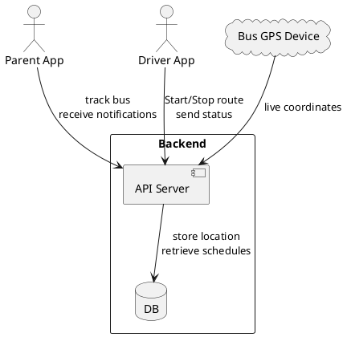

# School Bus Tracking Application Design

This application functions similarly to ride-sharing apps such as Uber, but is focused on tracking school buses. The diagram below outlines the primary components and how they interact.

* **Parent App** – Allows parents to view the current location of their child’s bus and receive notifications about pickups and drop-offs.
* **Driver App** – Used by the bus driver to start or end a route and to send status updates.
* **Bus GPS Device** – Hardware installed on each bus that sends real-time GPS coordinates.
* **Backend** – Consists of an API server and a database for storing bus routes, schedules, and location history.

This setup ensures that parents can safely and conveniently monitor school buses in real time.
